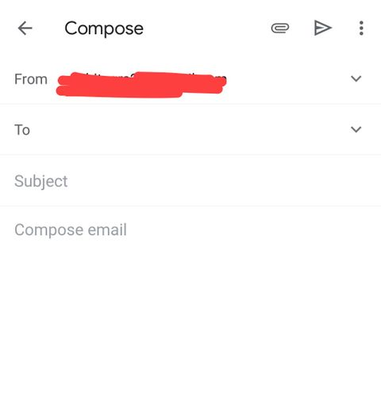

# Email-app

Below are the screenshots from the Gmail App. Your task is to recreate only the screens given below. You are free to customize the theme.

   

### Basic Structure of app (Basic Gmail part) 
It contains an email list screen as the home screen. On clicking on any email, the full description opens on another page. A button on the home screen allows the user to create and send a new email. After sending the email, the home screen opens automatically and the new list now contains sent email at the top. The home screen also has a search bar to search for any email in the list. On searching, only relevant emails should show up on the screen.
The user can also delete any email. (Home screen should update the list instantly after deleting)

### Points distribution -

- Email List page (30 points)
- Email Description page (30 points)
- Email create page (20 points)
- Navigation between screens (20 points)
- Delete email (10 points)
- Implementation of email sending (20 points)
- Implementaion of search bar (30 points)
- Use images in app (20 points)

### Bonus points -

- Delete email with swipe gesture (20 points)
- Design, smoothness and innovation (30 points)
- Use of local database to store email's content so that any new email will persist in every run of app (60 points)

## Deadline
You'll have a week to complete this task. Hence, the deadline of this task is Tuesday May 26th at 11:59 PM.
